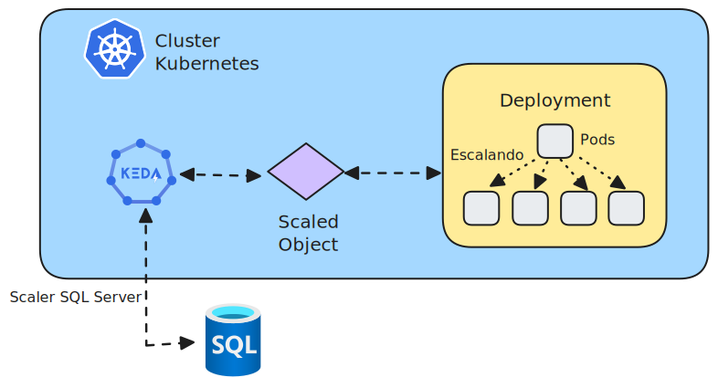

# Kubernetes-KEDA-MSSQL-Worker
Exemplo de uso do scaler MSSQL do KEDA para escalar um Worker com base no volume de dados não processados em um banco do SQL Server/Azure SQL.

## Arquitetura desta solução

